# IRIS#1 Architecture

## System Flow Diagram

```mermaid
graph TD

    %% --- Phase 1: Capture (Physical Input) ---

    User((User)) -->|Gaze & Chin Rest| Camera["📷 Camera\nCanon 5D / A7R2"]

    Camera -->|USB Tethering| Incoming[📂 Folder: /incoming]



    %% --- Phase 2: Python Backend (The Brain) ---

    subgraph "🐍 Python Backend (The Brain)"

        Incoming -.->|Watchdog Detects| Watcher{{Watcher Script}}

        Watcher -->|Trigger| Processor["⚙️ Image Processor\nOpenCV"]

        

        %% OpenCV Logic

        Processor -->|Grayscale & Blur| PreOp(Pre-processing)

        PreOp -->|Find Darkest Blob| PupilDet(Pupil Detection)

        PupilDet -->|Dynamic Masking| Donut["🍩 Donut Masking\n(Safe Zone Extraction)"]

        Donut -->|Crop 1000x1000| CropImg(Processed Iris Image)



        %% Analysis Logic

        CropImg -->|Pass Image| Analyzer["📊 FFT Analyzer\nNumPy"]

        Analyzer -->|FFT Transform| Spectrum(2D Spectrum)

        Spectrum -->|Radial Avg| Waveform(1D Waveform Array)

        Spectrum -->|Hash Pixels| Seed(Unique Seed ID)
        
        %% Latent Code Generation
        CropImg -->|Extract Features| CodeGen["🔑 Latent Code Generator\nlatent_code.py"]
        Spectrum -->|FFT Features| CodeGen
        CodeGen -->|Generate| LatentCode["📝 Latent Code\nIRIS/I?SEED=...GHO=..."]

    end



    %% --- Phase 3: Data Handoff (Data Exchange) ---

    CropImg -->|Save .jpg| OutFolder[📂 Folder: /processed]

    Waveform & Seed -->|Save .json| OutFolder
    
    LatentCode -->|Save .txt/.json| CodesFolder[📂 Folder: /codes]



    %% --- Phase 4: Frontend (Visual Presentation) ---

    subgraph "🎨 p5.js Frontend (The Face)"

        LiveServer(Live Server / Localhost) -->|Hosts| Sketch(sketch.js)

        OutFolder -.->|loadJSON & loadImage| Sketch
        
        CodesFolder -.->|load Latent Code| Sketch

        Sketch -->|Parse Code| Renderer["🎨 Iris Renderer\niris_renderer.js"]
        
        Renderer -->|Map Parameters| Visual(Generative Iris)

        Visual -->|Render| Screen["🖥️ Digital Wall / Monitor"]

    end



    %% Styles

    style Incoming fill:#f9f,stroke:#333,stroke-width:2px

    style OutFolder fill:#f9f,stroke:#333,stroke-width:2px

    style Donut fill:#ff9,stroke:#f66,stroke-width:2px,stroke-dasharray: 5 5

    style Analyzer fill:#ccf,stroke:#333,stroke-width:2px
    
    style CodeGen fill:#9cf,stroke:#333,stroke-width:2px
    
    style CodesFolder fill:#f9f,stroke:#333,stroke-width:2px
```



## Architecture Overview

### Phase 1: Capture (Physical Input)
- **User** → **Camera** (Canon 5D / A7R2) via USB tethering
- Photos saved to `data/incoming/` folder

### Phase 2: Python Backend (The Brain)

**Image Processing Pipeline:**
1. **Watcher Script** (`watch_folder.py`) - Detects new photos
2. **Image Processor** (`iris_processor.py`) - OpenCV processing
   - Pre-processing: Grayscale & Blur
   - Pupil Detection: Find darkest blob
   - Donut Masking: Safe Zone extraction (1.1x to 2.2x pupil radius)
   - Output: Processed iris image (2048x2048)

**Analysis Pipeline:**
3. **FFT Analyzer** (`analysis.py`) - NumPy FFT computation
   - FFT Transform: 2D spectrum
   - Radial Average: 1D waveform array (64 points)
   - Seed Generation: Hash pixels for unique ID

### Phase 3: Data Handoff (Data Exchange)
- Processed images → `data/processed/` (iris-001.jpg, iris-002.jpg, ...)
- Analysis data → `data/processed/` (analysis_iris-001.json, ...)
  - Contains: seed, energy, complexity, waveform (64 points)

### Phase 4: Frontend (Visual Presentation)
- **p5.js Frontend** (`sketch.js`)
  - Live server hosts the interface
  - Loads latent codes from `data/codes/`
  - Parses latent code parameters
  - Maps parameters to generative visual effects
  - Renders Digital Iris on screen/monitor (Digital Wall)

## Data Flow

```
Camera Photo
  ↓
data/incoming/
  ↓
watch_folder.py (detects)
  ↓
iris_processor.py (Safe Zone extraction)
  ↓
data/processed/iris-XXX.jpg
  ↓
analysis.py (FFT → waveform)
  ↓
latent_code.py (extract features → generate code)
  ↓
data/codes/code_iris-XXX.txt
  ↓
frontend/sketch.js (loads & parses code)
  ↓
iris_renderer.js (renders generative visualization)
  ↓
Digital Iris Wall (screen display)
```

## Key Components

### Backend Files
- `watch_folder.py` - File watcher, triggers processing
- `iris_processor.py` - Pupil detection, donut masking, image processing
- `analysis.py` - FFT analysis, waveform extraction, feature extraction
- `fft_pipeline.py` - FFT visualization (optional)
- `latent_code.py` - Latent code generation (for frontend)

### Frontend Files
- `sketch.js` - Main p5.js sketch, state machine
- `iris_renderer.js` - Generative Digital Iris renderer
- `ui_state_machine.js` - UI state management

### Data Folders
- `data/incoming/` - Raw photos from camera
- `data/processed/` - Processed images and analysis JSON
- `data/fft/` - FFT visualizations (optional)
- `data/codes/` - Latent codes (for frontend)

## Current Implementation Status

✅ **Phase 1**: Camera input (folder-based)  
✅ **Phase 2**: Python backend processing  
   - ✅ Image processor with donut masking  
   - ✅ FFT analyzer with waveform extraction  
   - ✅ Latent code generation  
✅ **Phase 3**: Data handoff (file-based)  
✅ **Phase 4**: Frontend (format parser updated, rendering working)  

