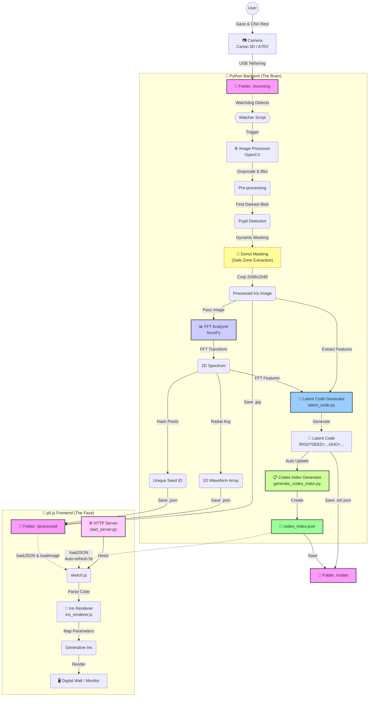

# IRIS#1 - Digital Biometrics

Interactive installation for MFA Interaction Design "Hello World" final project.

## Overview

IRIS#1 transforms a visitor's iris photograph into a unique generative "Digital Iris" - a looping, animated circular pattern representing their biometric signature.

**Workflow:**
1. Iris photographed with DSLR → saved to `data/incoming/`
2. Python backend processes: detects pupil → extracts Safe Zone ring → computes FFT → generates waveform
3. Web frontend renders Digital Iris from waveform data
4. Added to "Digital Iris Wall" gallery

## Architecture Flow



## Quick Start

### Backend

```bash
# Setup
python3 -m venv venv
source venv/bin/activate
pip install -r requirements.txt

# Process photos
python -m backend.iris_processor  # Process all images in data/incoming/
python -m backend.watch_folder    # Auto-process new photos
```

**Output:** `data/processed/iris-001.jpg`, `iris-002.jpg`, ... (2048x2048)

### Frontend

**Option 1: Use the project server (recommended)**
```bash
python3 start_server.py
# Open http://localhost:8000
```

**Option 2: Use Live Server or Python HTTP server**
```bash
cd frontend
python3 -m http.server 8000
# Open http://localhost:8000/index.html
```

**Controls:** 
- SPACE: Simulate capture (generates new Digital Iris)
- T: Test transform with random code
- R: Reset to EXHIBIT state
- C: Reload codes from backend

**Auto-refresh:** Frontend automatically loads codes from `data/codes_index.json` every 5 seconds.

## Project Structure

```
├─ backend/          # Python processing pipeline
│  ├─ watch_folder.py      # File watcher, triggers processing
│  ├─ iris_processor.py   # Pupil detection, donut masking (Safe Zone)
│  ├─ analysis.py         # FFT analysis, waveform extraction
│  ├─ fft_pipeline.py     # FFT visualization
│  ├─ latent_code.py      # Latent code generation
│  └─ config.py           # Configuration
├─ frontend/         # p5.js web interface
│  ├─ sketch.js           # Main sketch, state machine
│  ├─ iris_renderer.js    # Digital Iris renderer
│  └─ ui_state_machine.js # UI state management
├─ data/            # Runtime data
│  ├─ incoming/     # Raw photos from camera
│  ├─ processed/    # Processed images & analysis JSON
│  ├─ fft/          # FFT visualizations
│  └─ codes/        # Latent codes
└─ docs/            # Documentation (see ARCHITECTURE.md for flow diagram)
```

## Features

✅ Safe Zone ring extraction (pupil detection, donut masking)  
✅ High-resolution output (2048x2048)  
✅ FFT analysis with 1D waveform extraction (64 points)  
✅ Feature extraction (seed, energy, complexity, waveform)  
✅ Latent code generation (`IRIS/I?SEED=...GHO=...GDH=...`)  
✅ Frontend state machine and Digital Iris renderer  

## Latent Code Format

```
IRIS/I?SEED=2481739201GHO=212GDH=18GRO=0.41GRING=0.27GTEX=0.63G/1=0.010
```

Each iris generates a unique code. Parameters: SEED, GHO (brightness), GDH (contrast), GRO (radial), GRING (ring), GTEX (texture), G/1 (frequency).

## Status

- Backend: ~95% complete ✅
- Frontend: ~90% complete ✅
- Integration: ~90% complete ✅ (frontend reads codes from backend)

## Work Log

### 2024-12-01: Complete Integration
- ✅ Created `generate_codes_index.py` to generate JSON index for frontend
- ✅ Updated frontend to load codes from backend via HTTP
- ✅ Added auto-refresh mechanism (every 5 seconds)
- ✅ Created `start_server.py` for easy project serving
- ✅ Backend automatically updates codes index when new codes are generated
- ✅ Frontend supports multiple URL paths for different server setups
- ✅ Complete end-to-end workflow: Backend → JSON → Frontend → Display

### 2024-12-01: Extract Real Pupil, Get Donut Ring
- ✅ Implemented robust pupil detection (multiple threshold strategies: OTSU, adaptive, simple)
- ✅ Created Safe Zone ring extraction (donut mask: 1.1x to 2.2x pupil radius)
- ✅ Upgraded output resolution to 2048x2048 pixels
- ✅ Added automatic sequential file naming (iris-001.jpg, iris-002.jpg, ...)
- ✅ High-quality image interpolation (LANCZOS4 for upscaling, CUBIC for downscaling)
- ✅ Successfully extracts clean iris ring, avoiding eyelids and eyelashes

## Notes

Learning project with beginner-friendly code structure and clear comments.
